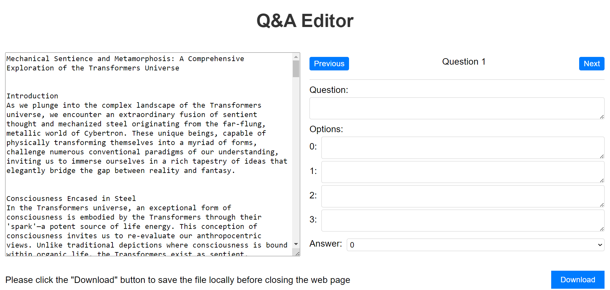

# Q&A Generator

A website that can convert multiple choice questions entered by users into jsonl format:



```json
{
    question: "",
    options: ["0", "1", "2", "3"],
    answer: "0/1/2/3"
}
```

Other question types may be available in the future.
